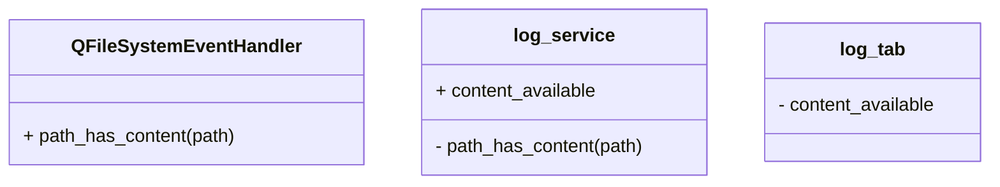
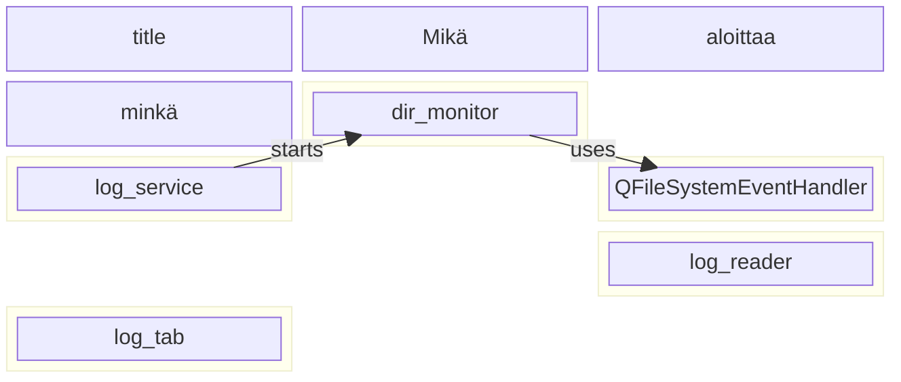
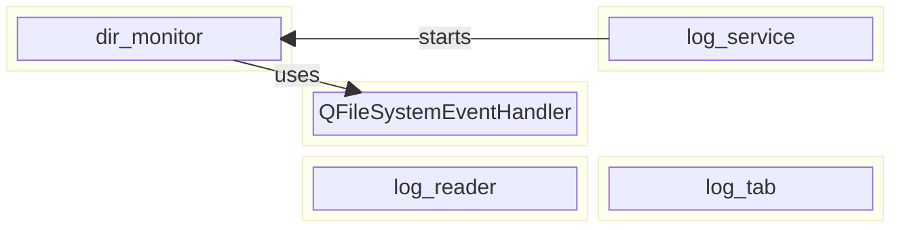

```mermaid
classDiagram
    class QFileSystemEventHandler {
        + path_has_content(path)
    }
    class log_service {
        - path_has_content(path)
        + content_available
    }
    class log_tab {
        - content_available   
    }
```

Järjestys on ok.

```mermaid
block-beta
    columns 3
    title Mikä aloittaa minkä
block
    dir_monitor
end
space
block
    log_service
end
space
block
    QFileSystemEventHandler
end
space:2


block
    log_reader
end
block
    log_tab
end
log_service --"starts"--> dir_monitor
dir_monitor --"uses"--> QFileSystemEventHandler
```

```mermaid
block-beta
    columns 3
block
    dir_monitor
end
space
block
    log_service
end
space
block
    QFileSystemEventHandler
end
space:2


block
    log_reader
end
block
    log_tab
end
log_service --"starts"--> dir_monitor
dir_monitor --"uses"--> QFileSystemEventHandler
```

```mermaid
classDiagram
    class log_service {
        
    }
    class dir_monitor {
        
    }
    class log_reader {
        
    }
    class log_tab {
        
    }
```
